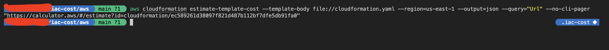
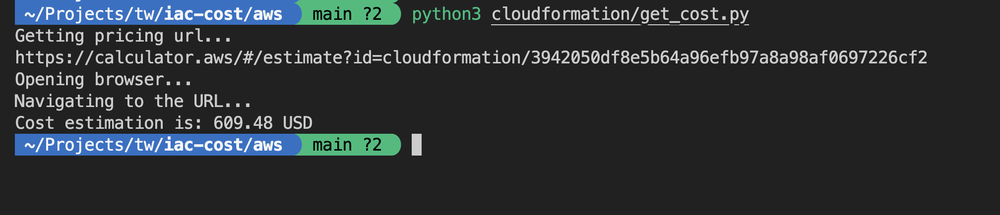

## AWS Cloudformation template cost estimation

AWS offers a native solution for estimating the cost of CloudFormation templates. You can estimate costs for an AWS CloudFormation template using the following command:

```shell
aws cloudformation estimate-template-cost --template-body file://<file_path> --region=<region_name>
```

For example:

```shell
aws cloudformation estimate-template-cost --template-body file://cloudformation.yaml --region=us-east-1 --output=json --query="Url" --no-cli-pager
```

The command will return a URL in the output, which you can visit to access the cost estimation.

Output:



### Scraping cost from URL

You can automate the process of scraping cost information from the webpage URL provided by the AWS CLI output.

For instance, you can use Python and Playwright to perform the scraping.

One example is provided using Python and Playwright. To run the program, First, install the dependencies listed in requirements.txt and then run the following command:

```shell
python3 cloudformation/get_cost.py
```


