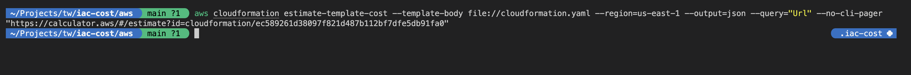
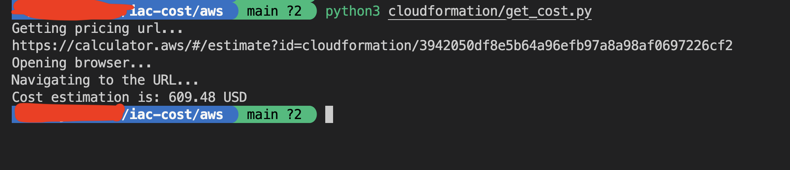

## AWS Cloudformation template cost estimation

To estimate costs using an AWS CloudFormation template, use the following command:

```shell
aws cloudformation estimate-template-cost --template-body file://<file_path> --region=<region_name>
```

Ex:

```shell
aws cloudformation estimate-template-cost --template-body file://cloudformation.yaml --region=us-east-1 --output=json --query="Url" --no-cli-pager
```

The command will provide a URL in the output, which you can use to access the cost estimation.

Output:



### Scrape cost from url

You can use tools to scrape cost information from the webpage URL.

One example is provided using Python and Playwright. To run the program, first install the dependencies listed in requirements.txt.


