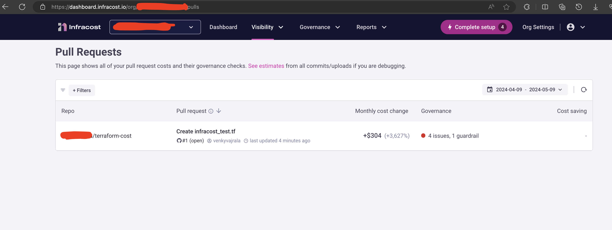

### IAC cost estimation using Infracost tool

It supports both cli based and UI based integration

You need to sign up for an account to use infracost

#### Output

Supported services can be found [here](https://www.infracost.io/docs/supported_resources/overview/)

[Azure ARM/bicep](https://github.com/infracost/infracost/issues/812) , [cloudformation](https://github.com/infracost/infracost/issues/190) and [pulumi](https://github.com/infracost/infracost/issues/187) support plans can be tracked
