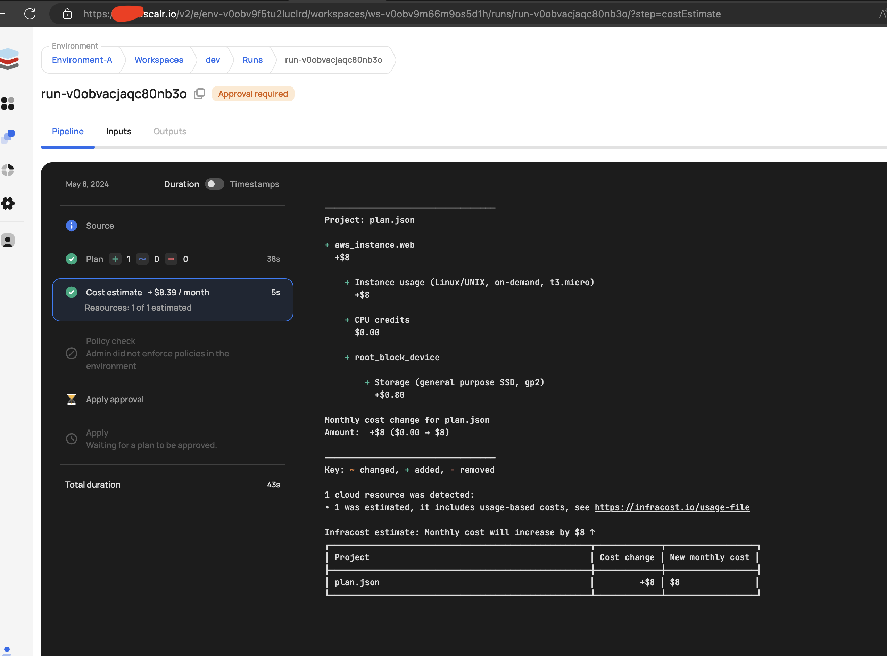

1. Create a account at https://scalr.io/v2/signup/
2. Create provider integration
3. Create workspace
4. Create VCS integration
5. Trigger workflow

### Note:
Scalr negotiated with the Infracost team to allow free usage of the Infracost Cloud Pricing Server server until June 30th, 2024. Beyond that date, you will have to sign up for an account with Infracost to enable the integration with Scalr.

### Output

You can continue to use Infracost by signing up for an account and adding the Infracost integration. The Infracost service is free up to 1,000 runs per month. See more on the pricing details [here](https://www.infracost.io/pricing/).