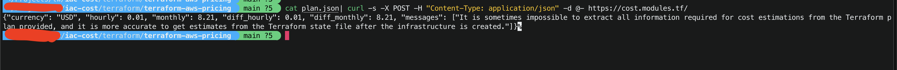

### Terraform aws cost estimation using terraform-aws-pricing tool

1. Generate plan output

```shell
terraform plan -out=plan.tfplan > /dev/null && terraform show -json plan.tfplan > plan.json
```

2. Use one of the method mentioned [here](https://github.com/terraform-aws-modules/terraform-aws-pricing?tab=readme-ov-file#examples) to get cost estimation

I am using curl method to get cost estimation

```shell
cat plan.json| curl -s -X POST -H "Content-Type: application/json" -d @- https://cost.modules.tf/
```

#### Output



Supported services can be found [here](https://github.com/terraform-aws-modules/terraform-aws-pricing?tab=readme-ov-file#supported-resources).
